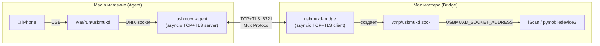

# NetworkUSB

> **Async usbmuxd network tunnel** — прозрачный проброс iOS-устройства с удалённого Mac на мастер-машину по TCP/TLS.

---

## Что это и зачем

При диагностике iPhone в сети магазинов возникает проблема: диагностическое ПО ([iScan](../iScan)) работает на центральном Mac мастера, а iPhone физически подключён к другому Mac в торговом зале. `libimobiledevice` и `pymobiledevice3` умеют работать только с локально подключённым устройством через `/var/run/usbmuxd`.

**NetworkUSB решает это:** туннелирует UNIX-сокет `usbmuxd` между двумя машинами по сети так, что для диагностического ПО всё выглядит как локальное подключение.

```
iPhone ── USB ── [ Mac в магазине ]          [ Mac мастера ]
                   usbmuxd-agent   ←TCP/TLS→  usbmuxd-bridge
                   :8721                       /tmp/usbmuxd.sock
                                                     │
                                              iscan / pymobiledevice3
```

---

## Архитектура



### Бинарный протокол мультиплексирования

Поверх одного TCP+TLS соединения мультиплексируются N независимых сессий:

| Bytes | Поле | Описание |
|-------|------|----------|
| 1 | `msg_type` | CONNECT / DATA / CLOSE / HEARTBEAT |
| 4 | `session_id` | uint32, монотонно растёт, не сбрасывается при реконнекте |
| 4 | `payload_len` | длина данных (0 для control-фреймов) |
| N | `payload` | сырые байты usbmuxd |

---

## Структура проекта

```
NetworkUSB/
├── pyproject.toml                  # hatchling, Python 3.11+, CLI entry points
├── README.md                       # этот файл
│
├── src/networkusb/
│   ├── protocol.py                 # Фреймы: read_frame / build_frame
│   ├── tls.py                      # TLS: cert gen, fingerprint, known_hosts pinning
│   ├── utils.py                    # Logging, TCP keepalive, backoff
│   ├── agent/
│   │   ├── server.py               # AgentServer: AUTH + mux + usbmuxd relay
│   │   └── main.py                 # CLI: usbmuxd-agent
│   └── bridge/
│       ├── client.py               # BridgeClient: reconnect + UNIX socket + relay
│       └── main.py                 # CLI: usbmuxd-bridge
│
├── launchdaemons/
│   └── com.usbmuxd.agent.plist    # macOS LaunchDaemon (автозапуск агента)
│
└── tests/
    ├── test_protocol.py            # 15 unit tests — протокол
    ├── test_tls.py                 # 16 unit tests — TLS, cert, known_hosts
    └── test_tunnel.py              # 4 integration tests — полный round-trip
```

---

## Безопасность

| Механизм | Детали |
|----------|--------|
| **TLS 1.2+** | Весь трафик шифруется. Self-signed сертификат генерируется при первом запуске агента |
| **Token auth** | Bridge отправляет `AUTH <token>\n` до передачи данных. Агент проверяет |
| **Certificate pinning** | Bridge сохраняет SHA-256 fingerprint в `~/.config/usbmuxd-bridge/known_hosts` при первом подключении (TOFU). Все следующие подключения — проверяют |
| **Fingerprint mismatch** | Bridge отказывается подключаться и выводит ошибку — защита от MITM |

---

## Быстрый старт

### Агент (Mac с iPhone)

```bash
# Установка
pip install -e .

# Запуск (требует sudo для доступа к /var/run/usbmuxd)
sudo usbmuxd-agent --token mysecret --foreground
```

При старте агент выведет TLS-fingerprint — передайте его оператору bridge.

### Bridge (Mac с iScan)

```bash
usbmuxd-bridge --agent-host 192.168.1.10 --token mysecret
```

Bridge выведет:
```
export USBMUXD_SOCKET_ADDRESS=unix:/tmp/usbmuxd.sock
```

### Запуск iScan

```bash
export USBMUXD_SOCKET_ADDRESS=unix:/tmp/usbmuxd.sock
iscan report --open
```

> **iOS 17+:** дополнительно нужен `sudo pymobiledevice3 remote start-tunnel`
> (этот туннель сам работает поверх пробрасываемого usbmuxd)

---

## Установка как LaunchDaemon (автозапуск агента при загрузке)

```bash
# 1. Укажите путь к установленному агенту в plist (заменить __NETWORKUSB_AGENT_BIN__)
nano launchdaemons/com.usbmuxd.agent.plist

# 2. Создайте токен-файл (root-owned 0600) — секрет НЕ хранится в plist
printf '%s' 'YOUR_SECRET_TOKEN' | sudo tee /etc/networkusb/token >/dev/null
sudo chown root:wheel /etc/networkusb/token && sudo chmod 600 /etc/networkusb/token

# 3. Установка (современный launchctl bootstrap)
sudo cp launchdaemons/com.usbmuxd.agent.plist /Library/LaunchDaemons/
sudo chown root:wheel /Library/LaunchDaemons/com.usbmuxd.agent.plist
sudo chmod 644 /Library/LaunchDaemons/com.usbmuxd.agent.plist
sudo launchctl bootstrap system /Library/LaunchDaemons/com.usbmuxd.agent.plist

# 4. Проверка
sudo launchctl print system/com.usbmuxd.agent   # state=running, pid=...
tail -f /var/log/usbmuxd-agent.log

# Удаление
sudo launchctl bootout system/com.usbmuxd.agent
sudo rm /Library/LaunchDaemons/com.usbmuxd.agent.plist
```

---

## CLI

### `usbmuxd-agent`

| Параметр | Default | Описание |
|----------|---------|----------|
| `--host` | `0.0.0.0` | IP для прослушивания |
| `--port` | `8721` | TCP порт |
| `--token` | — | Токен аутентификации (обязательный, если нет `--token-file`) |
| `--token-file` | — | Путь к файлу секрета (root 0600). Приоритетнее `--token`/`USBMUXD_TOKEN` |
| `--usbmuxd-path` | `/var/run/usbmuxd` | Путь к локальному usbmuxd сокету |
| `--cert-dir` | `~/.config/usbmuxd-agent` | Директория TLS-сертификата |
| `--log-level` | `INFO` | DEBUG / INFO / WARNING / ERROR |
| `--foreground` / `-f` | false | Не писать в файл лога (для отладки) |

### `usbmuxd-bridge`

| Параметр | Default | Описание |
|----------|---------|----------|
| `--agent-host` | — | Хост агента (обязательный) |
| `--agent-port` | `8721` | Порт агента |
| `--token` | — | Токен аутентификации (обязательный) |
| `--socket-path` | `/tmp/usbmuxd.sock` | Локальный UNIX-сокет для libimobiledevice |
| `--log-level` | `INFO` | DEBUG / INFO / WARNING / ERROR |

Оба параметра `--token` читаются также из переменной окружения `USBMUXD_TOKEN`.

---

## Разработка и тесты

```bash
# Dev install
pip install -e ".[dev]"

# Все тесты
pytest tests/ -v

# Только быстрые unit-тесты (без сети)
pytest tests/test_protocol.py tests/test_tls.py -v

# Интеграционные тесты (поднимает агент + bridge в памяти)
pytest tests/test_tunnel.py -v

# Линтинг
ruff check src/ tests/

# Типизация
mypy src/
```

---

## 📋 Трекер реализации

### ✅ Фаза 1 — Реализация (завершена)

| # | Компонент | Файл | Статус |
|---|-----------|------|--------|
| 1 | Конфигурация пакета | `pyproject.toml` | ✅ |
| 2 | Бинарный протокол | `src/networkusb/protocol.py` | ✅ |
| 3 | TLS / сертификаты / pinning | `src/networkusb/tls.py` | ✅ |
| 4 | Утилиты (logging, keepalive, backoff) | `src/networkusb/utils.py` | ✅ |
| 5 | AgentServer (mux + relay + watchdog) | `src/networkusb/agent/server.py` | ✅ |
| 6 | Agent CLI | `src/networkusb/agent/main.py` | ✅ |
| 7 | BridgeClient (reconnect + flow ctrl) | `src/networkusb/bridge/client.py` | ✅ |
| 8 | Bridge CLI | `src/networkusb/bridge/main.py` | ✅ |
| 9 | LaunchDaemon plist | `launchdaemons/com.usbmuxd.agent.plist` | ✅ |
| 10 | Документация | `README.md` | ✅ |

### ✅ Фаза 2 — Unit тесты (завершена)

| # | Тест | Покрытие | Статус |
|---|------|----------|--------|
| 11 | Протокол: все типы фреймов | `tests/test_protocol.py` — 15 тестов | ✅ 15/15 |
| 12 | TLS: cert, fingerprint, known_hosts | `tests/test_tls.py` — 16 тестов | ✅ 16/16 |

### ✅ Фаза 3 — Интеграционные тесты (завершена)

| # | Тест | Описание | Статус |
|---|------|----------|--------|
| 13a | Round-trip | Данные проходят bridge → agent → mock usbmuxd → назад | ✅ |
| 13b | 5 последовательных сессий | Все получают правильный ответ | ✅ |
| 13c | TOFU fingerprint | Bridge сохраняет fingerprint при первом подключении | ✅ |
| 13d | Reconnect после рестарта агента | Bridge переподключается с backoff | ✅ |

> Полный набор: **35/35** (15 protocol + 16 TLS + 4 tunnel). Примечание по
> стабильности: `AgentServer` завершается через явный `stop()`/`asyncio.Event`,
> а не через отмену `serve_forever()` — отмена `serve_forever()` при живом
> bridge-подключении дедлачит в Python 3.14 (подробности в `PROBLEMS.md` §3).

### ✅ Фаза 4 — Реальное тестирование

| # | Задача | Описание | Статус |
|---|--------|----------|--------|
| 14 | Тест с реальным iPhone | Запустить агента на машине с iPhone, bridge на мастере | ✅ |
| 15 | Тест iScan через туннель | `iscan report` через NetworkUSB | ✅ |
| 16 | iOS 17+ tunnel | `pymobiledevice3 remote start-tunnel` поверх NetworkUSB | ✅ не требуется |
| 17 | LaunchDaemon | Проверить автозапуск через `launchctl` | 🔄 |

> Проверено на реальном железе (2026-08-11): iPhone 12 mini (iPhone13,1, iOS 27.0)
> физически на **Mac Pro** (агент `usbmuxd-agent`), **Mac Air** (мастер,
> `usbmuxd-bridge`) читал его через TLS-туннель. `pymobiledevice3 usbmux list`,
> `lockdown info` и `iscan info`/`iscan report` работают через `/tmp/usbmuxd.sock`.
> Девайс: UDID `00008101-001110291410001E`, серийник FFWDK4JL0GPP.

### ⬜ Фаза 5 — Production-hardening (опционально)

| # | Задача | Описание | Статус |
|---|--------|----------|--------|
| 18 | `uv` packaging | Поддержка `uv tool install` как в iScan | ⬜ |
| 19 | `--version` команда | Отображение версии в CLI | ⬜ |
| 20 | Метрики сессий | `usbmuxd-agent status` — число активных сессий | ⬜ |
| 21 | CI/CD | GitHub Actions: lint + test на PR | ⬜ |
| 22 | Поддержка нескольких bridge | Агент принимает несколько параллельных bridge-подключений | ⬜ |

---

## Известные ограничения

- **Один Bridge на агента** — архитектурно поддерживается несколько bridge, но не тестировалось
- **iOS 17+ remote tunnel** — требует дополнительного шага `remote start-tunnel`; сам туннель работает поверх нашего usbmuxd, но не автоматизирован
- **macOS only** — UNIX-сокеты и LaunchDaemon специфичны для macOS; на Linux потребуется адаптация путей

---

## Зависимости

| Пакет | Версия | Назначение |
|-------|--------|-----------|
| `typer` | ≥0.12 | CLI |
| `rich` | ≥13 | Цветной вывод, панели |
| `cryptography` | ≥42 | Генерация TLS-сертификатов |
| `pytest` | ≥8 | Тесты |
| `pytest-asyncio` | ≥0.23 | Async тесты |
